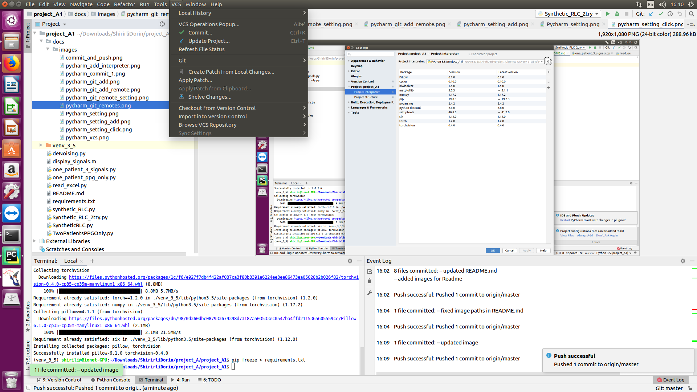

# Getting Started
Written by: Gil Caspi <gilcaspi@campus.technion.ac.il>

## Create an environment
1. Open a Virtual Environment:
    * File -> Setting -> Project -> Project Interpreter:
        
    * Click the Setting icon:
        
    * Chose Add (to add a new project interpreter):
        
    * Create a new Python Virtualenv:
        Choose Python 3.5 interpreter (create in venv folder inside the project)
        
2. Install project requirements:
    ```
    pip install -r requirements.txt
    ```
3. When adding a new package to the project (after installing it) update the requirements.txt file by using:
    ```
    pip freeze > requirements.txt
    ```

## Sync with Github
1. Open a Github account (if you use your Technion email you can get a student account
   with private repositories for free) - already done.
2. Open a Project in Github through browser - already done.
3. In Pycharm click VCS:
    
4. Git Remotes:
    
5. Add new Git Remote:
    
6. Define Git remote settings:
    The URL will be given by the project in Github browser
    

## Simple Usage of Github from Pycharm:
1. Add file to git:
    Right click on the file -> Git -> Add
    
    **Note:** Do not add the virtual environment folder to git
2. Commit & Push changes:
    * **Note:** Commit will save on local Git, Commit & Push will save both on local git and on Github domain
                (you will be able to view the changes on the browser)
    
    * Choose the files to commit & push, write a short commit message about the changes.
      Make sure you use (V signed next to): Reformat code, optimize imports, check TODO
    * **Choose Commit & Push**
        
**Note:** There are much more things that can be done with Github from Pycharm,
          for more details read Pycharm documentation or contact me.


